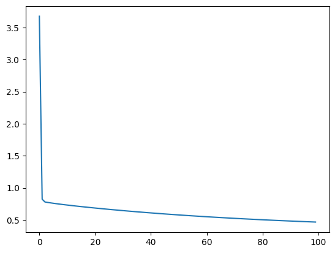

# Heart Disease - Classification

### Model
- Cross Entropy Loss  = 0.464514
- No. of Weights & Biases = 8
    #### Graph (Might be Wrong)
    - Loss per 1000 iter
      
        

### Data Dictionary : [House Pricing Dataset]

- Data : Columns 1 to  13 (Input.h)
- Target : Column 14 (Output.h)

**Column Position** | **Attribute Name** |  **Description**                                                                                     | **Attribute Type**    
--------------------| -------------------|  ----------------------------------------------------------------------------------------------------|------------------
     #1             |   MedInc           |  Median income for households                                                                        | quantitative
     #2             |   HouseAge         |  Median age of a house                                                                               | quantitative
     #3             |   AveRooms         |  Average number of rooms                                                                             | quantitative           
     #4             |   AveBedrms        |  Total number of bedrooms within a block                                                             | quantitative    
     #5             |   Population       |  Total number of people residing                                                                         | quantitative     
     #6             |   AveOccup         |  (fasting blood sugar > 120 mg/dl) (1 = true; 0 = false)                                             | qualitative
     #7             |   Latitude         |  A measure of how far west a house is                                              | qualitative
     #8             |   Longitude        |  A measure of how far north a house is                         | quantitative
     #9             |   House Pricing    |  exercise induced angina (1 = yes; 0 = no)                                                           | qualitative
                   

---

