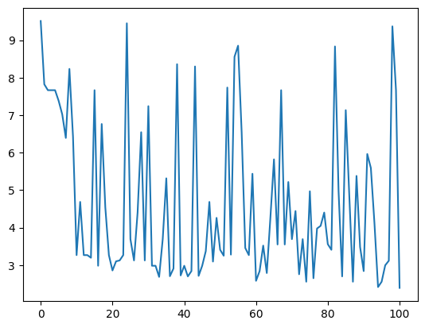

# Heart Disease - Classification

### Model
- Acurracy  = 84.175084
- Cross Entropy Loss  = 2.390485
- No. of Weights & Biases = 13
    #### Graph (Might be Wrong)
    - Loss per 1000 iter
      
        

### Data Dictionary : [Heart Disease Dataset](https://code.datasciencedojo.com/datasciencedojo/datasets/tree/master/Heart%20Disease)

- Data : Columns 1 to  13 (Input.h)
- Target : Column 14 (Output.h)

**Column Position** | **Attribute Name** |  **Description**                                                                                     | **Attribute Type**    
--------------------| -------------------|  ----------------------------------------------------------------------------------------------------|------------------
     #1             |   age              |  age of the patient                                                                                  | quantitative
     #2             |   sex              |  gender of the patient                                                                               | qualitative
     #3             |   cp               |  type of chest pain (1:'Typical Angina', 2:'atypical angina', 3:'non-anginal pain', 4:'asymptomatic')| qualitative           
     #4             |   trestbps         |  resting blood pressure (in mm Hg on admission to the hospital)                                      | quantitative    
     #5             |   chol             |  serum  cholesterol in mg/dl                                                                         | quantitative     
     #6             |   fbs              |  (fasting blood sugar > 120 mg/dl) (1 = true; 0 = false)                                             | qualitative
     #7             |   restecg          |  resting ECG results (0: 'normal', 1 and 2: 'abnormal')                                              | qualitative
     #8             |   thalach          |  maximum heart rate achieved                                                                         | quantitative
     #9             |   exang            |  exercise induced angina (1 = yes; 0 = no)                                                           | qualitative
     #10            |   oldpeak          |  ST depression induced by exercise relative to rest                                                  | quantitative
     #11            |   slope            |  the slope of the peak exercise ST segment (1: 'upsloping', 2: 'flat', 3: 'down sloping)             | qualitative
     #12            |   ca               |  number of major vessels (0-3) colored by fluoroscopy                                                | qualitative   
     #13            |   thal             |  thalassemia (3: 'normal', 6: 'fixed defect' , 7: 'reversible defect')                               | qualitative    
     #14            |   num              |  angiographic disease status (0: no heart disease, 1: heart disease)                               | qualitative

---

